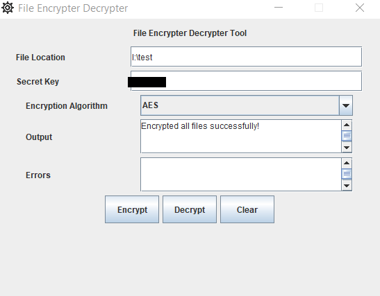
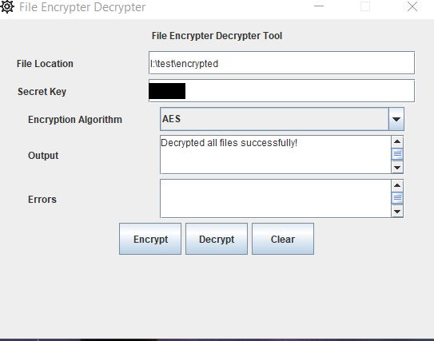

# File Encrypter Decrypter

A Java Swing based application that allows you to encrypt and decrypt files for a given folder.

## How to Use
Below are the steps on how to encrypt and decrypt using the tool
### Encryption
- Add the folder location(<source_location>) whose file contents you want to encrypt
  
- Add the secret key
- Click on Encrypt button and the encrypted files will appear in <source_location>/encrypted
  

### Decryption
- Add the folder location(<source_location>) whose file contents you want to decrypt
  
- Add the secret key
- Click on Decrypt button and the encrypted files will appear in <source_location>/encrypted
  

## Try it

[Download and run the app](docs/FileEncrypterDecrypter.jar)
